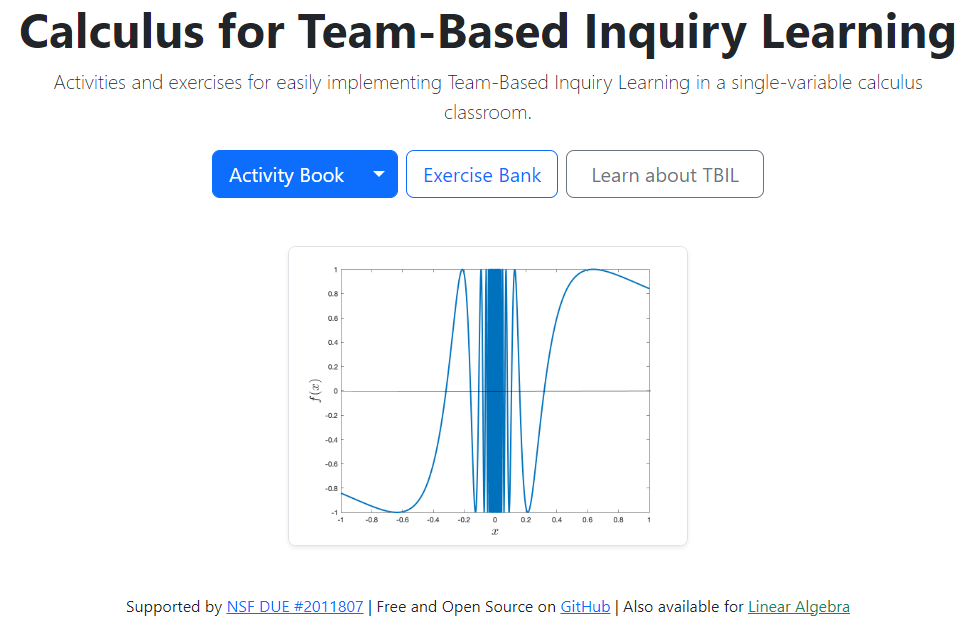
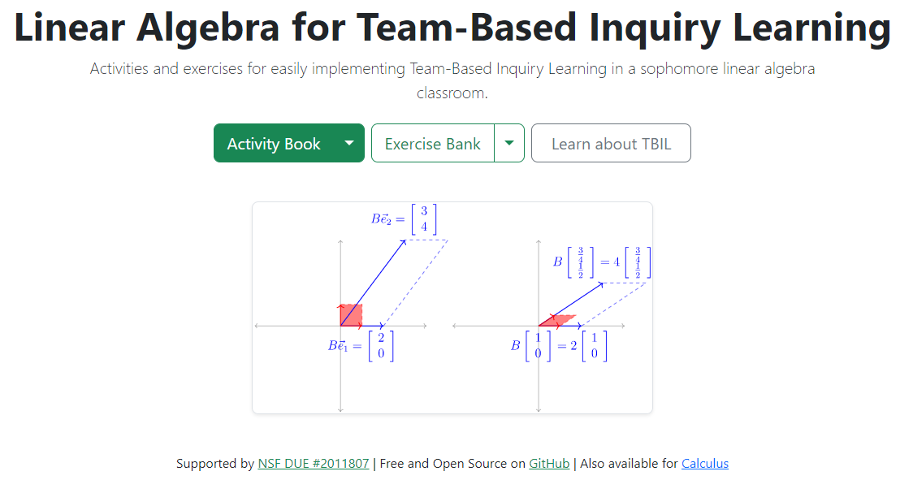
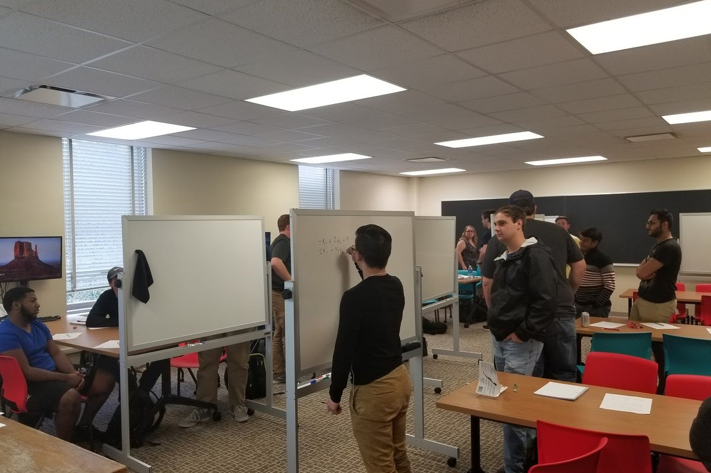
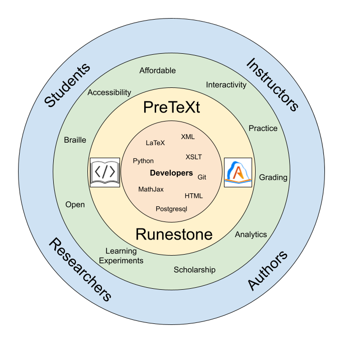
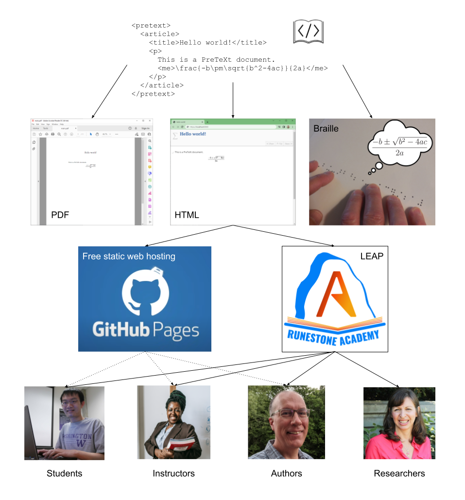

## Metrizability of Mahavier products indexed by partial orders

Steven Clontz | University of South Alabama

*Joint work with Jacob Dunham* | *Slides at* [clontz.org](https://clontz.org)

---

## Abstract

Let \\(X\\) be separable metrizable, and let \\(f\\subseteq X^2\\) be
a non-trivial relation on \\(X\\). For a given partial order \\(\\tuple{P,\\leq}\\),
the Mahavier product \\(\\maProd{X,f,P}\subseteq X^P\\) (also known as a generalized inverse limit)
collects functions such that \\(x(p)\\in f(x(q))\\) for all \\(p&lt;q\\).
We will show that whenever \\(f\\) satisfies condition \\(\\Gamma\\),
\\(\\maProd{X,f,P}\\) is separable metrizable if and only if \\(P\\) is countable.

---

## Example 1/4: 

\\(\\maProd{I,\\gamma,\\omega}\\cong\\,\\textcolor{gray}{???}\\)

<small>[C]: annotate slide / [B]: overlay whiteboard</small>

---

## Example 2/3: 

\\(\\maProd{I,\\gamma,\\omega_1}\\cong\\,\\textcolor{gray}{???}\\)

---

## Example 3/3: 

\\(\\maProd{I,\\gamma,I}\\cong\\,\\textcolor{gray}{???}\\)

---

## Definitions

For a partial order \\(Q\\), let \\(\\check Q\subseteq \\mathcal P(Q)\\)
be its leftward subsets, that is, \\(b\leq a\\in A\\Rightarrow b\\in A\\)
for each \\(A\\in\\check Q\\)

Then \\(\check Q\\) is partially ordered by \\(\\subseteq\\) and contains
the subset \\[Q'=\\{(\\leftarrow,q]:q\\in Q\\}\\] order-isomorphic to \\(Q\\).
Also, \\(\check Q\\) contains the subset
\\[\\hat Q=\\{A\\in\\check Q:A\\text{ is closed in }Q\\}\\] order-isomorphic
to the Dedekind[-ish*](https://en.wikipedia.org/wiki/Dedekind%E2%80%93MacNeille_completion) completion of \\(L\\).

---

## Theorem (C, unpublished)

Let \\(K\\) be a compact LOTS with minimum \\(0\\) and maximum \\(1\\).
Let \\(L\\) be a linear order.

Then the Mahavier product \\(\maProd{K,\\gamma,L}\\) is a copy of
the quotient of the lexicographic product \\(\\hat L \\times K\\) with
the following identifications.

-   <!-- .element: class="fragment" -->
    \\(|B\\setminus A| = 1 \\Rightarrow \\tuple{A,1}\\sim\\tuple{B,0}\\)

-   <!-- .element: class="fragment" -->
    \\(A\\in \\hat L\\setminus L' \\Rightarrow \\tuple{A,x}\\sim\\tuple{A,y}\\)

---

## Example 4/3: 

\\(\\maProd{I,\\gamma,\\mathbb Q}\\cong\\,\\textcolor{gray}{???}\\)

---

## Example 5/3: 

\\(\\maProd{I,\\gamma,2^{&lt;\\omega}}\\cong\\,\\textcolor{gray}{???}\\)

---

## Theorem 2/? (C &amp; Dunham, 2022)

Let \\(2=\\{0,1\\}\\) have its (discrete) order topology.
Let \\(P\\) be a partial order.

Then the Mahavier product \\(\maProd{2,\\gamma,P}\\) is a copy of
\\(\\check P\\) with the partial order topology induced by \\(\subseteq\\): each \\(A\\in\\hat P\\)
has a basic open neighborhood \\((B,C)\\) where \\(B\\subsetneq A\\subsetneq C\\).

---

## Theorem 3/? (C &amp; Dunham, 2022)

Let \\(B\\tuple{T,F}=\\{A\\in\\check P:T\\subseteq A\\wedge F\\cap A=\\emptyset\\}\\).

Then \\(\\{B\\tuple{T,F}:T,F\\in\[P\]^{&lt;\\aleph_0}\\}\\) is a basis for
the partial order topology on \\(\\check P\\).

---

## Theorem 4/4! (C &amp; Dunham, 2022)

\\(\\check P\\) is second-countable if and only if
\\(P\\) is countable.

### Proof, Part 1

If \\(P\\) is countable, \\(2^P\\) is second-countable,
and therefore its subspace
\\(\\maProd{2,\\gamma,P}\\cong\\check P\\) is second-countable.

---

### Proof, Part 2, of 2

Suppose \\(P\\) is uncountable and \\(\\mathcal{B}\\) is a basis for 
\\(\\check{P}\\). Then for all \\(p\\in P\\), fix \\(B_p\\in \\mathcal{B}\\) such 
that \\((\\leftarrow,p]\\in B_p\\subseteq B\\tuple{\\{p\\},\\emptyset}\\). Now let 
\\(p\\neq q\\), and without loss of generality assume \\(p\\not\\leq q\\). 
Therefore, \\((\\leftarrow,q]\\not\\in B\\tuple{\\{p\\},\\emptyset}\\), and so 
\\((\\leftarrow,q]\\not\\in B_p\\). By construction we have \\((\\leftarrow,q]\\in B_q\\), and
so it must be that \\(B_p\\neq B_q\\). Thus, each \\(B_p\\) is unique, and so 
\\(\\mathcal{B}\\) must be uncountable, showing that \\(\\check{P}\\) is not second-countable.

---

## Housekeeping

- We generally only care about **\\(V\\)-relations** \\(f\\):
  closed, idempotent, surjective, serial subsets of \\(X^2\\).

-   <!-- .element: class="fragment" -->
    \\(\\maProd{X,f,P}\\) is a closed subspace of \\(X^P\\).

-   <!-- .element: class="fragment" -->
    Let \\(f\\) have **Condition \\(\\Gamma\\)**: there are \\(x_0,x_1\\in X\\)
    distinct such that \\(\\tuple{x_0,x_0},\\tuple{x_0,x_1},\\tuple{x_1,x_1}\\in f\\)

    - A \\(V\\)-relation either has Condition \\(\\Gamma\\), or is the identity, or
    \\(X\\) has an infinite subset without limit points.

-   <!-- .element: class="fragment" -->
    Then \\(\\maProd{2,\\gamma,P}\\cong\\check P\\) is a closed subspace of
    \\(\\maProd{X,f,P}\\).

---

## Corollaries

- Let \\(X\\) be separable metrizable, \\(f\\) satisfy
condition \\(\\Gamma\\), and \\(P\\) be a partial order.
Then \\(\\maProd{X,f,P}\\) is
separable metrizable if and only if \\(P\\) is countable.

- Let \\(X\\) be compact metrizable, \\(f\\) satisfy
condition \\(\\Gamma\\), and \\(P\\) be a partial order.
Then \\(\\maProd{X,f,P}\\) is
compact metrizable if and only if \\(P\\) is countable.

---

## Things to investigate...

-   Let \\(X\\) be a (metrizable) continuum. When is
    \\(\\maProd{X,f,P}\\) a (metrizable) continuum?
    -   Van Nall (2012) has some tools for \\(\maProd{X,f,\\omega}\\)
        that may be adaptable.
-   <!-- .element: class="fragment" -->
    When is \\(\\check P\\) Corson compact?
    - C/Varagona (2019) observed that for ordinals \\(\\alpha\\),
      \\(\\check \\alpha\\cong \\alpha+1\\) is Corson compact if and only if
      \\(\\alpha\\) is countable.
    - If \\(\\check P\\) is not Corson compact, neither is
      \\(\\maProd{X,f,P}\\).

---

## What else am I working on?

Glad you asked!

---

## Team-Based Inquiry Learning

<https://teambasedinquirylearning.github.io>

Supported by [NSF EDU #2011807](https://nsf.gov/awardsearch/showAward?AWD_ID=2011807)

---

---

## TBIL Project Highlights

- Adapts Inquiry-Based Learning into format accessible to
  100/200-level math courses.

- Team structure emulates small class size within larger classroom.

- High-quality [TBIL Resource Library](https://sites.google.com/southalabama.edu/tbil/tbil-resource-library)
  provides in-class activities ([PreTeXt](https://pretextbook.org)) 
  and randomized exercises ([CheckIt](https://checkit.clontz.org)) for implementing TBIL.

- Research/evaluation on around 30 instructors around country trained/implementing TBIL is ongoing.

---

## My focus: cyberinfrastructure

Technology lowers the barrier for novel teaching practices.

-   [PreTeXt](https://pretextbook.org): XML language that produces
    accessible HTML, printable PDF, tactile braille, and more from
    a single source.

-   [CheckIt](https://checkit.clontz.org): framework to author
    randomized exercises using SageMath programming language, deployed
    to static HTML/JS to produce LaTeX/PDF, or in LMS quizzes.

-   [Scratchee](https://scratchee.clontz.org): web app to provide
    free mechanism for employing Instant Feedback Assessment Technique.

---

## The Problem

Who creates this infrastructure?

-   <!-- .element: class="fragment" -->
    Private industry
    -   focus on profit, not learning, accessibility...

-   <!-- .element: class="fragment" -->
    Educators / Edu Researchers
    -   generally lack expertise to create high-quality software products

-   <!-- .element: class="fragment" -->
    Content-area scholars
    -   if they have expertise, they generally lack incentive

---

## Enter NSF TIP and POSE

### Directorate for Technology, Innovation and Partnerships (TIP)

A new (Spring 2022) NSF directorate that "creates breakthrough technologies; meets societal and economic needs;
leads to new, high-wage jobs; and empowers all Americans to participate in the U.S. research and innovation enterprise."

### Pathways to Enable Open-Source Ecosystems (POSE)

A new (Spring 2022) solicitation for "harnessing the power of open-source development for the creation of new technology solutions
to problems of national and societal importance."

---

## PreTeXt-Runestone OSE

<https://prose.runestone.academy>

Supported by [NSF TIP #2230153](https://www.nsf.gov/awardsearch/showAward?AWD_ID=2230153)

---

---

## PROSE 2023 activities

- Roundtables with stakeholders
- Webinars and virtual office hours to onboard new members to community
- Organizing Workshop June 12-16 in Mobile
- Phase II proposal (two years, $1.5M) due in Fall

---

## Future Work

How can mathematics **research** be enchanced through better
cyberinfrastucture?

- Next-generation documents (PreTeXt)
- Semantically-searchable databases (OEIS, LMFDB, [pi-Base](https://topology.pi-base.org))
- Confernece organizing (Topology Atlas)
- Integration of formalized mathematics in all of the above

---

# THANK YOU!

### Questions?

Slides at [clontz.org](https://clontz.org)
