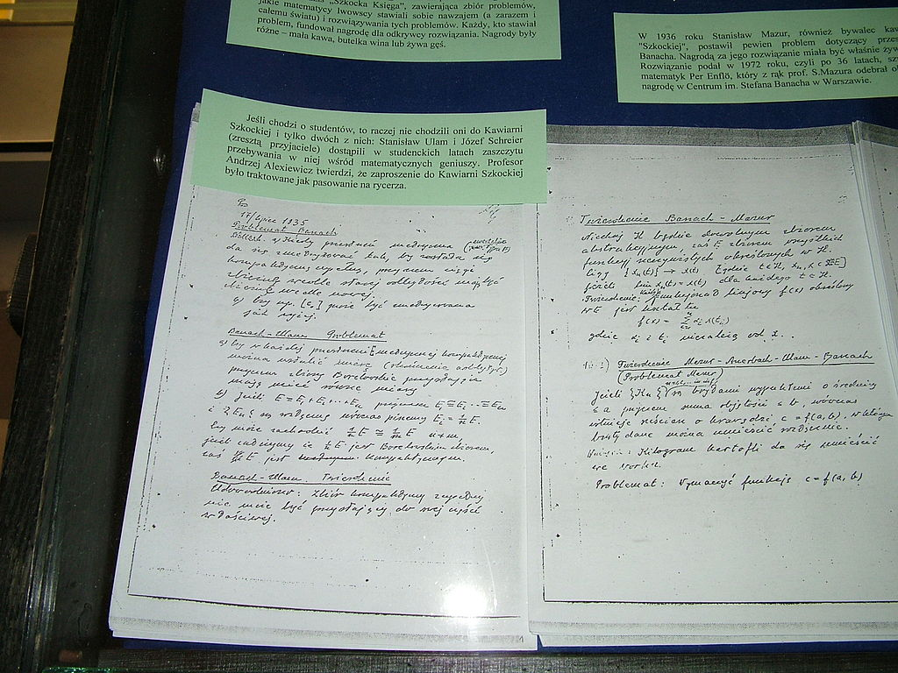

# Counting the Uncountable
### or, How I Learned to Stop Worrying and Love Elementary Submodels

Steven Clontz | University of South Alabama

*Joint work with Will Brian* | *Slides at* [clontz.org](https://clontz.org)

---

## Abstract 1/2

Consider the following two-player game. Let \\(W\\) be some subset of the reals.
During the initial round, Alice chooses \\(-\infty\\) and Bob chooses
\\(+\infty\\). Say a number is *legal* provided it is a real number strictly
greater than all of Alice's choices and strictly less than all of Bob's choices.
Then each subsequent choice of either player must be legal, and
after \\(\omega\\)-many rounds, Alice wins this game provided that some number
in \\(W\\) remains legal.

---

## Abstract 2/2

Bob has a winning strategy in this game if and only if \\(W\\) is countable.
To see this, we will demonstrate two proofs accessible to a general mathematical 
audience, one utilizing countable elementary submodels, and the other involving
limited information strategies.

---

## Baker's Game

<small>[C]: annotate slide / [B]: overlay whiteboard</small>

---

## History of Baker's Game 1/4

- Based upon a game defined in 1998 by Grossman, Turett
  for [Mathematics Magazine problem #1542][MathMagProb], which was
  solved by Newcomb in [1999][MathMagSol].

[MathMagProb]: https://www.jstor.org/stable/i326797
[MathMagSol]: https://www.jstor.org/stable/i326802

---

## History of Baker's Game 2/4

- Named for Matt Baker, who in [2007][MathMagBaker] showed several basic results
  for an equivalent game he called the "Cantor game":
    - If \\(W\subseteq\mathbb R\\) is countable, then Bob has a winning strategy.
      <!-- .element: class="fragment" -->
    - If \\(W\subseteq\mathbb R\\) contains a perfect set
      (non-empty, closed, all points are
      limits), then Alice has a winning strategy.
      <!-- .element: class="fragment" -->
    - Therefore, we have a neat game-theoretic proof that the reals (which are
      perfect) are uncountable.
      <!-- .element: class="fragment" -->

[MathMagBaker]: https://www.jstor.org/stable/27643064

---

## History of Baker's Game 3/4

- In a [2017][LaDue] ArXiV submission, Baker's student LaDue improves
  the Alice result: \\(W\subseteq\mathbb R\\) contains a perfect set
  **if and only if** Alice has a winning strategy.

[LaDue]: https://arxiv.org/abs/1701.09087

---

## History of Baker's Game 4/4

-   The proof that Bob can force a win given a countable set \\(W\\) is pretty quick:
    -   <!-- .element: class="fragment" -->
        Enumerate \\(W=\\{w_n:n&lt;\omega\\}\\).
    -   <!-- .element: class="fragment" -->
        For Bob's \\(n\\)th move, he plays \\(w_n\\) if it's still legal, and
        plays an arbitrary number otherwise.
    -   <!-- .element: class="fragment" -->
        Since each element \\(w_n\\in W\\) is either already illegal before Bob's
        \\(n\\)th move, or made illegal by Bob as his \\(n\\)th move, Bob wins.

---

## Baker's Question
-   <!-- .element: class="fragment" -->
    Does there exist an uncountable set \\(W\\) that allows Bob a winning
    strategy?
    - <!-- .element: class="fragment" -->
        Will Brian emailed me in January 2022: Nope.

---
<!-- .slide: data-transition="slide-in fade-out" -->

## Sketch of a Proof

-   <!-- .element: class="fragment" -->
    Let \\(\\sigma\\) be a strategy for Bob that only uses rationals.
    Assume Alice only plays rationals.
-   <!-- .element: class="fragment" -->
    For each partial playthrough \\(t\\), define
    \\[E_t = \\{x\\text{ legal}|a&lt;x\\Rightarrow\\sigma(t^\\frown\\langle{a}\\rangle)\\leq x\\}\\]
-   <!-- .element: class="fragment" -->
    \\(E_t\\) cannot contain bounded decreasing subsequences, as Alice picking infimum
    creates a contradiction.
-   <!-- .element: class="fragment" -->
    For \\(w\\) not in \\(\bigcup_t E_t\\) (countable), Alice can ensure \\(w\\) remains legal
    the whole game. If \\(w\\in W\\), Alice wins!

---
<!-- .slide: data-transition="fade" -->

## Sketchy Proof 🙃

-   <!-- .element: class="" -->
    Let \\(\\sigma\\) be a strategy for Bob that only uses rationals.
    Assume Alice only plays rationals.
-   <!-- .element: class="" -->
    For each partial playthrough \\(t\\), define
    \\[E_t = \\{x\\text{ legal}|a&lt;x\\Rightarrow\\sigma(t^\\frown\\langle{a}\\rangle)\\leq x\\}\\]
-   <!-- .element: class="" -->
    \\(E_t\\) cannot contain bounded decreasing subsequences, as Alice picking infimum
    creates a contradiction.
-   <!-- .element: class="" -->
    For \\(w\\) not in \\(\bigcup_t E_t\\) (countable), Alice can ensure \\(w\\) remains legal
    the whole game. If \\(w\\in W\\), Alice wins!

---
<!-- .slide: data-transition="fade-in slide-out" -->

## Sketchy Proof 😲

-   <!-- .element: class="" -->
    Let \\(\\sigma\\) be a strategy for Bob that only uses rationals.
    **Assume Alice only plays rationals.**<!-- .element: style="color:cyan" -->
-   <!-- .element: class="" -->
    For each partial playthrough \\(t\\), define
    \\[E_t = \\{x\\text{ legal}|a&lt;x\\Rightarrow\\sigma(t^\\frown\\langle{a}\\rangle)\\leq x\\}\\]
-   <!-- .element: class="" -->
    \\(E_t\\) cannot contain bounded decreasing subsequences, as 
    **Alice picking infimum**<!-- .element: style="color:cyan" -->
    creates a contradiction.
-   <!-- .element: class="" -->
    For \\(w\\) not in \\(\bigcup_t E_t\\) (countable), Alice can ensure \\(w\\) remains legal
    the whole game. If \\(w\\in W\\), Alice wins!

---

## Will's Response

"Ah, well, we can work around that."

    

"We can just use a countable elementary submodel."
    

<iframe src="https://giphy.com/embed/vNrFmUK6KZMPK" width="480" height="339" frameBorder="0" class="giphy-embed" allowFullScreen></iframe>
<a href="https://giphy.com/gifs/fonzie-the-fonz-gif-stories-vNrFmUK6KZMPK">via GIPHY</a>

---

## My initial reaction

<iframe src="https://giphy.com/embed/9Fticsj7froxbpd5Sg" width="480" height="400" frameBorder="0" class="giphy-embed" allowFullScreen></iframe>
<a href="https://giphy.com/gifs/theoffice-9Fticsj7froxbpd5Sg">via GIPHY</a>

---

## But, after a few moments

<iframe src="https://giphy.com/embed/BpGWitbFZflfSUYuZ9" width="480" height="400" frameBorder="0" class="giphy-embed" allowFullScreen></iframe>
<a href="https://giphy.com/gifs/captain-america-NENOgw8mgH0NW">via GIPHY</a>

---

## So what do we need to know?

-   <!-- .element: class="fragment" -->
    While there are uncountable sets, any proof (whether written in English letters
    or formalized) is finite, and so there are only countably-many possible proofs.
-   <!-- .element: class="fragment" -->
    So perhaps this result, a consequence of Löwenheim-Skolem theorem, isn't too surprising:
    -   <!-- .element: class="" -->
        Given a countable set \\(S\\) in your universe of sets, there exists a
        countable set \\(M\\supseteq S\\) in your universe
        such that any first-order statement about things defined for \\(M\\)
        is true in your universe if and only if \\(M\\) witnesses its truth.
    -   <!-- .element: class="fragment" -->
        That is, \\(M\\) is a countable elementary submodel for your universe.

---

## Will's proof 1/5

-   <!-- .element: class="fragment" -->
    Fix a countable elementary submodel \\(M\\) of our universe that contains
    Bob's strategy \\(\sigma\\) and the rationals.
-   <!-- .element: class="fragment" -->
    Then consider
    \\[E_t = \\{x\\text{ legal}|a&lt;x\\Rightarrow\\sigma(t^\\frown\\langle{a}\\rangle)\\leq x\\}\\]
    enumerated over partial playthroughs \\(t\\) using reals from \\(M\cap\mathbb R\\) rather than
    just \\(\mathbb Q\\).
-   <!-- .element: class="fragment" -->
    Suppose \\(w\not\in \\bigcup_t E_t\\) (countable). We will describe how Alice ensures
    \\(w\\) remains legal throughout the game.

---

## Will's proof 2/5

-   <!-- .element: class="" -->
    Suppose Alice has successfully played the game up to a certain round,
    where the partial playthrough \\(t\\) only uses moves from \\(M\\), and \\(w\\)
    remains legal.
-   <!-- .element: class="fragment" -->
    Since
    \\[w\not\in E_t=\\{x\\text{ legal}|a&lt;x\\Rightarrow\\sigma(t^\\frown\\langle{a}\\rangle)\\leq x\\}\\]
    there exists \\(a'&lt;w\\) such that \\(\\sigma(t^\\frown\\langle{a'}\\rangle)&gt; w\\).
-   <!-- .element: class="fragment" -->
    Note \\(a'\\) is legal, but not necessarily in \\(M\\)...

---

## Will's proof 3/5

-   <!-- .element: class="" -->
    Let \\(\\alpha,\\beta\\in M\\) be the last moves of Alice and Bob, respectfully.
    We now have the following reals
    \\[\\alpha &lt;a'&lt;w&lt;\\sigma(t^\\frown\\langle{a'\\rangle})&lt;\\beta\\]
    where \\(a',w,\\sigma(t^\\frown\\langle{a'\\rangle})\\) may not belong to \\(M\\).
-   <!-- .element: class="fragment" -->
    Choose \\(r,s\\in \\mathbb Q\\subseteq M\\) with 
    \\[\\alpha &lt;a'&lt;r&lt;w&lt;s&lt;\\sigma(t^\\frown\\langle{a'\\rangle})&lt;\\beta\\]
-   <!-- .element: class="fragment" -->
    Consider the set
    \\[A=\\{a\\in(\\alpha,r)| \\sigma(t^\\frown\\langle{a\\rangle})\\in(s,\\beta)\\}\\]
    such that \\(a'\\in A\\).

---

## Will's proof 4/5

-   <!-- .element: class="" -->
    Then 
    \\[A=\\{a\\in(\\alpha,r)| \\sigma(t^\\frown\\langle{a\\rangle})\\in(s,\\beta)\\}\\]
    is a set \\(M\\) understands, since \\(A\\) is defined in terms of 
    \\(\\alpha,r,\\sigma,t,s,\\beta\\in M\\).
-   <!-- .element: class="fragment" -->
    Observe that
    \\(A\\not=\\emptyset\\)
    is true in our universe since \\(a'\\in A\\).
-   <!-- .element: class="fragment" -->
    Thus \\(M\\) witnesses \\(A\\not=\\emptyset\\), which means there exists
    \\(a\\in M\\) such that \\(a\\in A\\).

---

## Will's proof 5/5

-   <!-- .element: class="" -->
    Finally, from \\(a\\in A\\cap M\\) we have
    \\[\\alpha &lt;a&lt;r&lt;w&lt;s&lt;\\sigma(t^\\frown\\langle{a\\rangle})&lt;\\beta\\]
    where \\(a,\\sigma(t^\\frown\\langle{a\\rangle})\\in M\\), and \\(w\\) remains legal.
-   <!-- .element: class="fragment" -->
    This completes the induction: Alice is able to play reals known to our countable
    elementary submodel \\(M\\) such that \\(w\\) remains legal during the whole game.
-   <!-- .element: class="fragment" -->
    Thus Alice can defeat any strategy for Bob when \\(W\\) is uncountable.

---

## Can you do this kind of thing without submodels?

-   <!-- .element: class="fragment" -->
    Sure!
    -   <!-- .element: style="font-size:0.7em" -->
        (if fact, you *always* can, but you may not want to)
-   <!-- .element: class="fragment" -->
    But for this problem, we can consider something called
    a *coding* strategy, that is, a strategy that only
    considers the most recent move of each player.
    -   <!-- .element: class="fragment" -->
        We'll see where the word "coding" comes from in a bit!

---

## Bob's Coding Strategy 1/3

-   Fact: Bob has a winning strategy for Baker's game if and only if
    Bob has a winning coding strategy.
-   <!-- .element: class="fragment" -->
    Proof:
    -   <!-- -->
        The backwards direction is immediate, so assume Bob has a
        winning strategy \\(\\sigma\\).
    -   <!-- .element: class="fragment" -->
        We proceed to show Bob has a coding strategy
        that produces strictly smaller legal choices than \\(\\sigma\\)
        would choose given the same choices by Alice.
    -   <!-- .element: class="fragment" -->
        Such a coding
        strategy allows the same or less legal numbers at
        the game's end, so it is also winning.

---

## Bob's Coding Strategy 2/3

-   <!--   -->
    Proof cont.:
    -   <!--  -->
        Fix a bijection \\(f:\\mathbb R^{&lt;\\omega}\to\\mathcal D\\), where
        \\(\\mathcal D\\) is a partition of \\(\\mathbb R\\) into dense subsets.
        -   <!-- .element: class="fragment" style="font-size:0.8em" -->
            Hints: \\(|\\mathbb R^{&lt;\\omega}|=|\\mathbb R|\\), and
            \\(p\\sim q\\Leftrightarrow p-q\\in\\mathbb Q\\) partitions
            the reals into \\(|\\mathbb R|\\)-many sets isomorphic to \\(\\mathbb Q\\).
    -   <!-- .element: class="fragment" -->
        This gives Bob a mechanism to *encode* any finite sequence of
        choices \\(t\\in\\mathbb R^{&lt;\\omega}\\) by Alice into any number from the
        dense set \\(f(t)\\), which always includes a legal number from
        between Alice and Bob's most recent moves.

---

## Bob's Coding Strategy 3/3

-   <!--   -->
    Proof cont.:
    -   <!--  -->
        So suppose \\(a,\\beta\\) are the most recent moves of Alice and Bob,
        and suppose \\(\\beta\\) encodes the sequence \\(t\\) of Alice's prior moves
        by \\(\\beta\\in f(t)\\).
    -   <!-- .element: class="fragment" -->
        Bob can reproduce his "normal" perfect-info move
        \\(b'=\\sigma(t^\\frown\\langle\\alpha\\rangle)\\) by decoding \\(\\alpha\\)
        into \\(t\\). He then encodes \\(t^\\frown\\langle\\alpha\\rangle\\) by choosing 
        his next move \\(b\\) to be any member of \\(f(t^\\frown\\langle\\alpha\\rangle)\\)
        between \\(a\\) and \\(b'\\).
    -   <!-- .element: class="fragment" -->
        As promised, this coding strategy produces smaller moves in response to Alice
        than \\(\\sigma\\), so it succeeds.

---

## Steven's Proof 1/2

-   <!-- .element: class="fragment" -->
    Let \\(\\sigma\\) be a *coding* strategy for Bob that only uses rationals.
-   <!-- .element: class="fragment" -->
    For each \\(q,\\beta\\in\\mathbb Q\\), define
    \\[E_{q,\\beta} = \\{x\\text{ legal}|a\\in(q,\\beta)\\Rightarrow\\sigma(\\beta,a)\\leq x\\}\\]
-   <!-- .element: class="fragment" -->
    \\(E_{q,\\beta}\\) cannot contain bounded decreasing subsequences, as \\(a=\\inf\\)
    creates a contradiction.
-   <!-- .element: class="fragment" -->
    Suppose \\(w\not\in \\bigcup_{q,\\beta} E_{q,\\beta}\\) (countable). We will describe how Alice ensures
    \\(w\\) remains legal throughout the game, defeating \\(\\sigma\\).

---

## Steven's Proof 2/2

-   <!-- .element: class="" -->
    Suppose Alice has successfully played the game up to a certain round,
    where \\(\\alpha,\\beta\\) were played most recently, and \\(w\\) remains legal,
    that is, \\(\\alpha&lt;w&lt;\\beta\\).
-   <!-- .element: class="fragment" -->
    Pick \\(q\\in\\mathbb Q\\) with \\(\\alpha&lt;q&lt;w&lt;\\beta\\).
-   <!-- .element: class="fragment" -->
    Since
    \\[w\\not\\in E_{q,\\beta} = \\{x\\text{ legal}|a\\in(q,x)\\Rightarrow\\sigma(\\beta,a)\\leq x\\}\\]
    there exists \\(a\\in(q,w)\\) such that \\(\\sigma(\\beta,a)&gt; w\\).
-   <!-- .element: class="fragment" -->
    Note \\(a\\) is legal, and results in \\(a&lt;w&lt;\\sigma(\\beta,a)\\),
    completing the induction.
    

---

## Results for Baker's Game

-   <!-- .element: class="fragment" -->
    Alice has a winning strategy if and only if \\(W\\) contains a perfect set.
-   <!-- .element: class="fragment" -->
    Bob has a winning (coding) strategy if and only if
    \\(W\\) is countable.
-   <!-- .element: class="fragment" -->
    Using the Axiom of Choice, one may construct a *Bernstein set* of real numbers
    that (in particular)
    is uncountable but is missing a number from every perfect set. Thus
    Baker's Game is *indetermined* for the Bernstein set.

---

## Wait, this sounds famliar...

Well, at least if you've heard of the *Banach-Mazur game*,
first introduced during the 1930s-40s at the "Scottish Cafe", 
frequented by mathematicians in the city known now as
Lviv, Ukraine.

<!-- .element: style="height:25vh" -->

<small>
    <a href="https://en.wikipedia.org/wiki/Scottish_Book#/media/File:KsiegaSzkocka1.JPG">
Part of the "Scottish Book", with notes of Stefan Banach and Stanislaw Ulam. CC BY-SA 3.0
    </a>
</small>

---

## The Banach-Mazur Game

In this game, Bob and Alice (Bob first) alternate picking open intervals within the previously
chosen interval, and Alice wins if a number in \\(W\\) remains in the intersection
of these intervals after \\(\\omega\\)-many rounds.

---

## Results for the Banach-Mazur Game

-   <!-- .element: class="fragment" -->
    Bob has a winning strategy if and only if \\(W\\)'s intersection with some open
    set is *meager*.
    -   <!-- .element: class="fragment" style="font-size:0.8em" -->
        Meager means "small" in a certain sense, including all countable sets,
        but meager sets can be uncountable: for example, a
        Cantor set.
-   <!-- .element: class="fragment" -->
    Alice has a winning (coding) strategy
    if and only if \\(W\\)'s complement is meager.
-   <!-- .element: class="fragment" -->
    A Bernstein set's intersection with each open set is non-meager, but its complement
    is also non-meager. So the Banach-Mazur game is also indetermined for such a set.

---

## Comparing these games

-   <!-- .element: class="fragment" -->
    Baker's game isn't equivalent to the Banach-Mazur game: Alice wins Baker's
    game for the uncountable Cantor set, but Bob wins Banach-Mazur as it's meager.
-   <!-- .element: class="fragment" -->
    But there's still a lot of similarities. So while Baker's game has so far been
    a "toy", maybe studying it will reveal insights for the widely-studied
    Banach-Mazur game?

---

## An open question

-   <!-- .element: class="fragment" -->
    How much *tactical* information does Alice or Bob need in Baker's game?
    -   A tactical strategy only tracks a limited amount of moves by the opponent,
        so coding information into your own moves is not possible(-ish).
-   <!-- .element: class="fragment" -->
    Telgársky famously conjectured that there exist versions of the Banach-Mazur
    game where Alice can win while keeping track of (say) 5 moves of Bob,
    but can be defeated when only using 4. 
-   <!-- .element: class="fragment" -->
    But Brian/Dow/Milovich/Yengulalp showed
    in [2019][2019] that such examples must depend on your axioms of set theory, or
    at least cannot be *regular*.

[2019]: https://arxiv.org/abs/1912.03327 

---

# THANK YOU!

### Questions?

Slides at [clontz.org](https://clontz.org)
